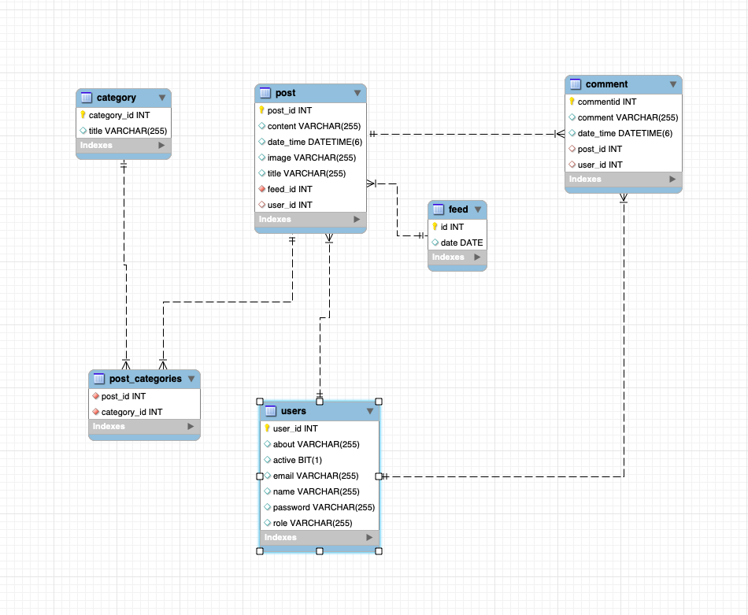

# Alphaware_Blog_Application

## Description

Alphaware Blog Application is a social media platform where users can create posts, comment on posts, and interact with other users. It provides features for user registration, login, creating posts, commenting on posts, managing categories, and more.

## ER Diagram

## Features

- User registration and login
- User roles (admin and user)
- Create, read, update, and delete (CRUD) operations for posts
- Create, read, update, and delete (CRUD) operations for comments
- Manage categories for posts
- View posts created on the current day
- Token-based authentication using JWT
- Role-based access control

## Technologies Used

- Spring Boot: Backend framework for building the application
- Spring Security: Provides authentication and authorization features
- JWT (JSON Web Tokens): Token-based authentication mechanism
- Hibernate: ORM framework for interacting with the database
- MySQL: Relational database management system
- Swagger: API documentation tool for documenting RESTful APIs
- Maven: Dependency management tool for Java projects
- Core Java: Provide code in java to manage Entity

## API Endpoints

### User Endpoints

- **POST** `/api/user/register`: Register a new user.
- **POST** `/api/user/login`: Log in with existing credentials.
- **GET** `/api/user/{id}`: Get user details by ID.
- **PUT** `/api/user/{id}`: Update user details.
- **DELETE** `/api/user/{id}`: Delete user.

### Post Endpoints

- **POST** `/api/posts/createPost/{userId}/{categoryId}`: Create a new post.
- **GET** `/api/posts/{id}`: Get post details by ID.
- **PATCH** `/api/posts/{id}`: Update post details.
- **DELETE** `/api/posts/{id}`: Delete post.

### Category Endpoints

- **POST** `/api/category/createCat`: Create a new category.
- **GET** `/api/category/{id}`: Get category details by ID.
- **GET** `/api/category/allCat`: Get all categories.
- **PUT** `/api/category/{id}`: Update category details.
- **DELETE** `/api/category/{id}`: Delete category.

### Comment Endpoints

- **POST** `/api/comments/createComm`: Create a new comment.
- **GET** `/api/comments/{id}`: Get comment details by ID.
- **GET** `/api/comments/getAll`: Get all comments.
- **PUT** `/api/comments/{id}`: Update comment details.
- **DELETE** `/api/comments/{id}`: Delete comment.

### Feed Endpoint

- **GET** `/api/feed/`: Get posts created on the current day.

## Setup Instructions

1. Clone the repository to your local machine.
2. Import the project into your preferred IDE (e.g., IntelliJ IDEA, Eclipse).
3. Set up a MySQL database and configure the application.properties file with the database connection details.
4. Run the application as a Spring Boot application.
5. Access the API documentation using Swagger at http://localhost:8080/swagger-ui.html.

## Usage

1. Register a new user using the `/api/user/register` endpoint.
2. Log in with the registered user using the `/api/user/login` endpoint to obtain an authentication token.
3. Use the obtained token to access protected endpoints that require authentication.
4. Explore the various endpoints to create, read, update, and delete posts, comments, and categories.
5. Use the Swagger documentation for detailed information on each endpoint.

